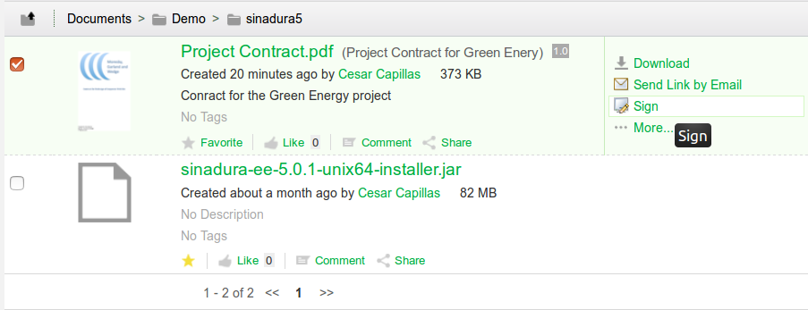
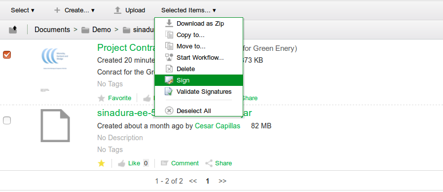
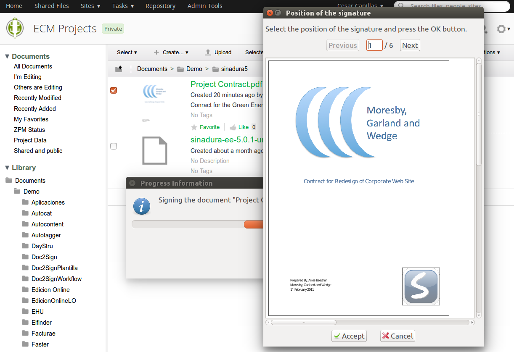
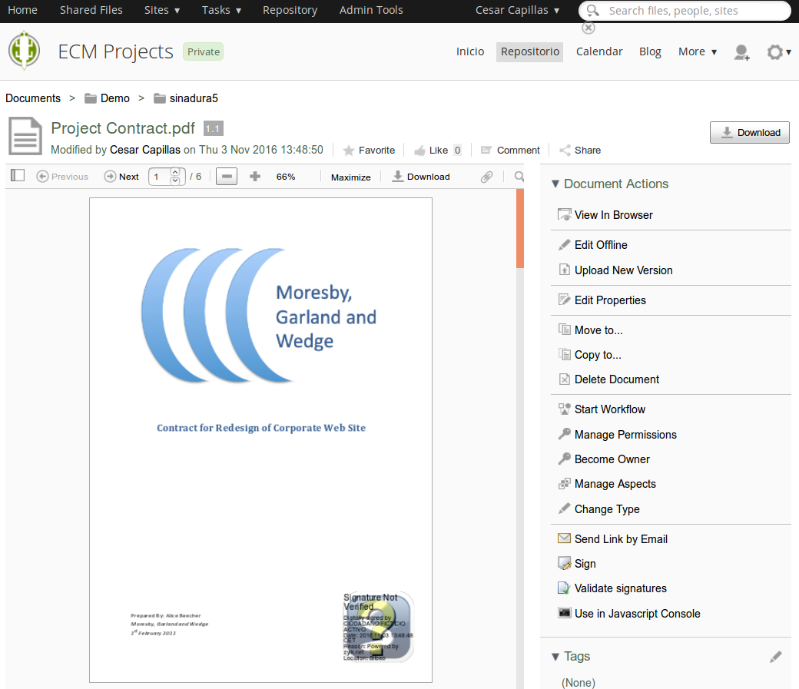

# Sinadura 5 for Alfresco ECM

Protocol based digital signatures for Alfresco

## Intro

Sinadura 5 for Alfresco is an addon for digital signature in Alfresco 5. The addon provides:

- Actions for signing one or several files in Alfresco Share client.
- The possibility of signing any type of file. Pades signatures are used for PDF files and Xades dettached for the other mimetypes.
- Advanced signature properties, such as timestamps or digital signature validations.
- Digital signature profiles, depending on your corporate certificates using custom images for signature stamps (for PDF only). You can - also place these visible stamps in a customized position of the document.
- Previews and metadata indicators for digital signatures

## Video demo

<a href='http://www.youtube.com/watch?feature=player_embedded&v=MCTpOKZtTgw' target='_blank'></a>

## Components
 
- Sinadura 5 Desktop (in your local machine): download desktop client from www.sinadura.net
- Sinadura Cloud Services (in Alfresco server)
- Alfresco AMPs (in Alfresco server) 

The installers of Sinadura 5 are available for Linux and Windows, and they include the installation of sinadura protocol in the operating system. The sinadura protocol works via a third party service (sinaduraCloud.war) installed in a servlet container that can be part of your Alfresco installation. Also, two AMP files are needed for Alfresco repository and Alfresco Share respectively. Another two AMPs are available for the validation of the digital signatures and the visualization of properties in Alfresco Share.

## Installation

In the client:

- Download sinadura 5 Desktop (for Windows or Linux)
- Install your software certificates or smartcards in your OS 
- Check that Sinadura Desktop is able to sign locally 

In the server:

- Install AMPs in Alfresco repo and Alfresco Share
- Copy sinaduraCloud.war into $ALF_HOME/tomcat/webapps
- Restart Alfresco service

## Configuration

### Configuring Sinadura Services Endpoint

This configuration may be in alfresco-global.properties file

```
#
# Sinadura online properties
#

# Sinadura Services endpoint
#zk.sign.sinadura.cloud.url=http://localhost:8080/sinaduraCloud
zk.sign.sinadura.cloud.url=http://<alfresco-host-frontend-url>/sinaduraCloud

# This option configures the signature type for PDF files. It may be PDF|XADES
zk.sign.pdf.signature.type=PDF

# This option enable to store all digital signatures in the same directory of the original document
zk.sign.upload.path.relative=true

# If previous property is false, a rootpath may be configured
zk.sign.upload.path.node=workspace://SpacesStore/dfe991c6-e558-44ce-ba75-27032b69568b
```

## Advanced and custom configuration 

### Configuring mimetypes

In addition, you can configure the mimetypes, for which you want to show the Sign with Sinadura action in:

zk-sign-online-context.xml (the  evaluator is disabled by default)
 
```
<config evaluator="string-compare" condition="DocLibActions">
     <actions>
          <action id="zk-sign-online" type="javascript" label="zk.label.sign.online" icon="zk-sign-online">
          <param name="function">onActionZKSignOnline</param>
          <!-- evaluator>zk-evaluator.doclib.action.signOnline</evaluator> -->
          <permissions>
               <permission allow="true">Write</permission>
          </permissions>
     </action>
</actions>
```
 
zk-sinadura-sign-online-share-extension.xml

```
<!-- evaluator mimetypes -->
<bean id="zk-evaluator.doclib.action.signOnlineMimetype" parent="evaluator.doclib.action.isMimetype">
	<property name="mimetypes">
		<list>
			<value>application/pdf</value>
		</list>
	</property>
</bean>
```

### Configuring Share previews for PDF signatures
In Share AMP, you must extend:

components/preview/pdfjs/pdf.worker.js

commenting this part.

```
if (this.data.fieldType === 'Sig') { 
	warn('unimplemented annotation type: Widget signature'); 
	return false;
}
```

### Cluster mode configuration

By the moment, in a clustered setup we need to configure a hot standby (active-passive). For example with an Apache frontend:

```
<VirtualHost *:8080>
	ServerName alfserver

	ErrorLog /var/log/apache2/alf-error.log
	CustomLog /var/log/apache2/alf-access.log combined
	
	<Proxy balancer://sinaduraCloud>
		BalancerMember ajp://alfnode2:8009 retry=30
		# the hot standby
		BalancerMember ajp://alfnode1:8009 status=+H retry=0
	</Proxy>

	ProxyPass /sinaduraCloud balancer://sinaduraCloud/sinaduraCloud lbmethod=byrequests stickysession=JSESSIONID|jsessionid
	ProxyPassReverse /sinaduraCloud ajp://alfnode1:8009/sinaduraCloud
	ProxyPassReverse /sinaduraCloud ajp://alfnode2:8009/sinaduraCloud
	ProxyPass / ajp://alfnode1:8009/
	ProxyPassReverse / ajp://alfnode2:8009/
</VirtualHost>
```

Please consider contribute to Sinadura for an improved cluster mode or new types of signature compatibility.

## Screenshots

### Sign action in Alfresco Share



### Sign multiple action in Alfresco Share



### Previews and custom position for digital signatures for PDF files



### Signature preview for PDF files




## Target setup 

- Sinadura 5 Desktop 
- Alfresco 201602GA
- Alfresco 201702GA
- Alfresco 5.0.3
- Alfresco 5.1.2

## Main contributors

Sinadura addon for Alfresco
- Alfredo Sanchez
- [Cesar Capillas](http://github.com/CesarCapillas)
- [Daniel Cañadillas](http://github.com/kaecius)

Sinadura Desktop client and Sinadura Services (sinaduraCloud.war)
- Alfredo Sanchez
- [Irune Prado](http://github.com/wideawakening)
- [Gustavo Fernandez](http://github.com/guszylk)

Internationalization of Sinadura
- [Douglas C.R. Paes](https://github.com/douglascrp) - Translation to Brazilian Portuguese.

## History 

```
201705 - Full config via alfresco-global.properties

201704 - Brazilian Portuguese translation

201703 - Maven SDK 2.2 based initial version
       - Revision of content model and properties
       - Surf extension configuration
       - Custom indicator 
       - Module naming, properties, and action labeling        
       - English translation
```

## Links
- www.sinadura.net
- http://www.zylk.net/es/web-2-0/blog/-/blogs/sinadura-5-for-alfresco
